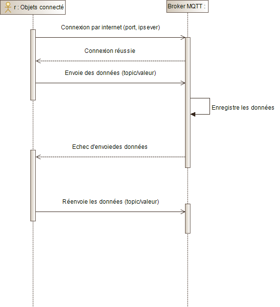
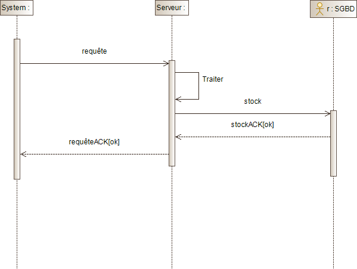

<!--This program is free software: you can redistribute it and/or modify
  it under the terms of the GNU General Public License as published by
  the Free Software Foundation, either version 3 of the License, or
  (at your option) any later version.

  This program is distributed in the hope that it will be useful,
  but WITHOUT ANY WARRANTY; without even the implied warranty of
  MERCHANTABILITY or FITNESS FOR A PARTICULAR PURPOSE.  See the
  GNU General Public License for more details.

  You should have received a copy of the GNU General Public License
  along with this program.  If not, see <https://www.gnu.org/licenses/>.-->

# SmartVilla

- - -
Table des matières
---------------------------------------------------------------------

1. [Introduction](#Introduction)
2. [Structure du projet](#Structure-du-projet)
3. [Pour commencer](#Pour-commencer)
4. [Application](#Application)
7. [Auteurs](#Auteurs)
8. [License](#License)
- - -

# Introduction

Dans le cadre de notre formation de master première année parcours technologie de l'internet (TI) à l'UPPA, nous sommes amenés à réaliser un projet tutoré a vocation académique. Ce projet a pour but de nourrir des réflexions, développer une analyse et contribuer à une solution impliquant une réalisation logicielle.
Notre équipe à réaliser le projet en partenariat avec l'entreprise Capgemini de Pau, représenté par COUMATES Matthieu et encadré par Rémi DOUTEAUD, Nicolas DUBOIS et Fabien LAMAS. Notre étude porte sur l'Internet des objets, et plus particulièrement le déploiement d'objets connectés par les collectivités françaises pour la mise en place des nouvelles "villes intelligentes", dans une logique de développement durable. Nous avons initié cette démarche avec la bâtisse d'une solution de surveillance de données pour une agence se voulant être une prémisse à l'élaboration dans le futur d'une solution à l'échelle d'une ville.

Nous avons réalisé une documentation pour expliquer tous le processeur de développement et permettre à n'importe quel utilisateur de pouvoir refaire chez lui le projet. 

# Structure du projet

```
SmartVilla-Assets - Directory with contains all extern files
├── sketch - Directory wich contains the arduino sketch files
|   ├── esp8266 - Directory wich contains the esp8266.io file
|   └── esp32 - Directory wich contains the arduino esp32.io file
└── doc - Directory witch contains docs content
    └── diagrams - Directory witch contains diagrams content
    └── images - Directory witch contains images content
SmartVilla-PlatformIO - Directory for project platform.io
├── include - directory witch contains contains header files
├── lib - directory witch contains the libs files
├── src - directory witch contains the main.cpp file
└── test - directory witch contains PIO Unit Testing
SmartVilla-Node-Red - Directory the projet WebApp with Node-Red Server 
```

# Pour commencer

## Prérequis du projet

- Connexion Internet

Nous avons réalisé une documentation en fonctions de divers usages possibles pour le développement du projet. 

- Soit vous utilisez ArduinoIDE
- Soit vous utilisez PlatformIO IDE

Ses deux usages différents ont leurs propres sections.

## Arduino IDE

### Prérequis

1. Installation d'Arduino IDE

Télécharger et installer sur votre machine la dernière version stable de l'IDE Arduino depuis **[le site officiel arduino](https://www.arduino.cc/en/Main/Software)**

3. Installation de l'outil Git

Télécharger et installer sur votre machine la dernière version stable de l'outil Git depuis **[le site officiel git](https://git-scm.com/downloads)**

4. Installation de l'interpréteur Python

Télécharger et installer sur votre machine la dernière version stable de Python depuis **[le site officiel python](https://www.python.org/downloads/)**

### Récupérer le projet avec Git

Pour récupérer le projet, ouvrer un terminal, accéder au répertoire où vous souhaitez mettre le projet et clonez-le à l'aide de la commande `git clone`

```
# Create a project folder and change into it
mkdir myproject && cd myproject
# Clone this repository into the project folder
git clone https://github.com/ymichiels/SmartVilla.git
```

### Configuration de l'ESP8266

Rendez-vous sur la page du doc officiel de l'ESP8266 pour Arduino : **[doc d'installation de l'ESP8266 pour arduino](https://arduino-esp8266.readthedocs.io/en/2.7.1/installing.html#boards-manager)** et veuillez suivre les étapes de configurations

### Configuration de l'ESP32

Rendez-vous sur la page du Git officiel de l'ESP32 : **[git officiel de l'ESP32](https://github.com/espressif/arduino-esp32)**, veuillez suivre les étapes de configurations. 

Une fois que l'installation d'arduino IDE a été réalisée et que vos ESP8266/ESP32 sont bien configurés, 

1. rendez-vous sur le dossier Arduino installé par défaut au chemin **`C:/Users/[YOUR_USER_NAME]/Documents/Arduino`**. 
2. déplacer le dossier sketch du projet que vous avez récupéré précédemment avec Git vers ce dossier

Si étape bien réalisée vous devez vous retrouver avec un dossier contenant 

```
arduino
├── hardware
|   └──espressif
|   ├── esp8266
|   └── esp32
├── librairies
└── sketch
    ├── esp8266
    └── esp32
```

Puis dans l'onglet `Preference`, vous pouvez spécifier l'emplacement du carnet de croquis avec le chemin **`D:\Documents\Arduino\sketch`**. Désormais, vous aurez dans **`carnet de croquis `** les sketchs des ESP.

## PlatformIO IDE `Recommandé`

### Prérequis

4. Installation de l'IDE gratuit Visual Studio Code

Télécharger et installer sur votre machine la dernière version stable de l'IDE VSC depuis **[le site officiel visualstudio](https://code.visualstudio.com/?wt.mc_id=DX_841432)**

Deux différents types d'installations vous sont présentées. A vous de voir laquelle vous préférez.

### Installation  basique

```
# Create a project folder and change into it
mkdir myproject && cd myproject
# Clone this repository into the project folder
git clone https://github.com/ymichiels/SmartVilla.git
```

Puis, ouvrer le projet sur Visual Studio Code.

### Installation  avec VCS

Après avoir installé VCS (Visual Studio Code). On va pouvoir installer le plugin PlatformIO sur VCS. Pour ce faire, veuillez vous rendre sur la doc officielle d'installation à cette **[page](https://docs.platformio.org/en/latest/integration/ide/vscode.html#installation)**.

### Récupérer le projet avec Git

Après avoir installé PlatformIO IDE, vous allez devoir récupérer le projet, 

1. rendez-vous sur le github, copier l'URL (`https://github.com/ymichiels/SmartVilla.git`) du GitHub dans la boite de dialogue **`Clone or download`**.
2. rendez-vous sur Visual Studio, coller le lien dans la palette de commande **Git: Clone** (Ctrl+Maj+P).

Brancher votre microcontrôleur, configurer le dans le fichier de configuration platform.ini en suivant les recommandation de la documentation officielle à cette **[page](https://docs.platformio.org/en/latest/projectconf/index.html)**, 

Relier vos capteurs au(x) microcontrôleur(s) puis réaliser les actions suivantes :

1. Build le programme
2. Upload and Monitor

Et voilà votre capteur affiche les données.

## Node-Red

### Prérequis

1. Installation de la plateforme Node.JS

Télécharger et installer sur votre machine la dernière version stable de Node.Js depuis **[le site officiel nodejs](https://nodejs.org/en/)**

### Utilisation

- Soit avec le terminal de votre machine
- Soit avec VCS qui prend en charge Node.JS 

Dans les deux cas, vous allez devoir vous rendre dans le dossier **`SmartVilla-Node-Red`** du projet. 

### Installer les dépendances

```
# Install the pre-requisite modules (Node-Red...)
npm install
# Install some additional nodes if required ...
#npm install node-red-contrib-xx node-red-contrib-yy --save
```

### Exécution

```
# Start the server (runs 'node server.js' in node-red directory)
npm start
```

et si tout se passe bien une instance de Node-Red va se lancer.

### Autres scripts

Vous pouvez utiliser les scripts suivants avec la commande **`npm run`** :

- `npm run start` : démarre l'instance du serveur Node-Red en exécutant `node server.js`.

- `npm run adminauth - [votre-mot-de-passe-ici]` : créer un hachage pour un mot de passe fourni.  Hachage réalisé, vous pouvez copié et collé le mot de passe haché généré dans le fichier `settings.js` pour vos comptes d'utilisateur.

- `npm run selfsigned - [nom-de-domaine-ici]` : créer des certificats auto-signés pour un nom de domaine fourni. Utilisé  pour exécuter https-Server. Génère les fichiers server.key et server.crt.


# Application

## Diagramme de cas d'utilisation du système


## Diagramme de séquence : protocoleMQTT


## Diagramme de séquence : Acquisition des données



## Diagramme de séquence : Consultation des données


## Diagramme de séquence : Stockage des données
 
 


# Auteurs

Auteurs Yan Michiels & Cebollado Johann.

# Licence

Notre application SmartVilla est libre et open-source avec les codes sources sous licence [GPL](https://www.gnu.org/licenses/licenses.fr.html)

TODO 

- [ ] Mettre la documentation sous licence [Creative Commons CC BY-SA 3.0](https://creativecommons.org/licenses/by-sa/3.0/fr/).

Note : La badgeuse c'est la vie
